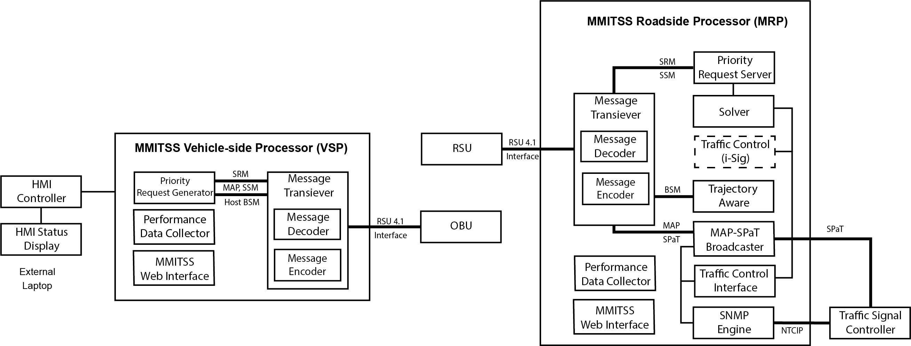

# MMITSS 
 The  Multi-Modal  Intelligent  Traffic  Signal  System  (MMITSS)  project  is  part  of  the  Connected Vehicle  Pooled  Fund  Study  (CV  PFS)  entitled  “Program  to  Support  the  Development  and Deployment of Connected Vehicle System Applications.”  The CV PFS was developed by a group of state and local transportation agencies and the Federal Highway Administration (FHWA).  The Virginia Department of Transportation (VDOT) serves as the lead agency and is assisted by the University  of  Virginia’s  Center for Transportation  Studies,  which  serves  as  the  technical  and administrative lead for the PFS.

The  USDOT    identified  six  mobility  application  bundles  under  the  Dynamic  Mobility Applications (DMA) program for the connected vehicle environment where high-fidelity data from vehicles, infrastructure, pedestrians, etc. can be shared through wireless communications. Each bundle contains a set of related applications that are focused on similar outcomes. Since a major focus  of  the  CV  PFS  members –who  are  the  actual  owners  and  operators  of  transportation infrastructure –lies in traffic signal related applications, the CV PFS team is leading the project entitled “Multi-Modal Intelligent Traffic Signal System” in cooperation with US DOT’sDynamic Mobility Applications Program. As one of the six DMA application bundles, MMITSS includes five applications:  Intelligent  Traffic  Signal  Control  (I-SIG),  Transit  Signal  Priority  (TSP),  Mobile Accessible Pedestrian Signal System (PED-SIG), Freight Signal Priority (FSP), and Emergency Vehicle Preemption (PREEMPT).The   MMITSS   prototype   was   developed   based   on   traffic   controllers   using   the   NTCIP communications  protocol  and  new  algorithms  for  providing  priority  control  (emergency  vehicle, transit,  and  truck  priority)  and  intelligent  signal  control  (e.g.  adaptive  control  using  connected vehicle data). 

The current implementation of MMITSS, based on the CV PFS Phase 3 – Deployment Readiness project, has been developed to be deployed on a variety of hardware platforms for both vehicles and at intersections. The Figure below shows the current MMITSS architecture. One of the objectives of the Phase 3 project was for the software to be hardware agnostic so that any vendor’s roadside units (RSU) and onboard  units (OBU) could be interfaced to the processors.

# Contributing Guide

Welcome to the MMITSS AZ open source project contributing guide. Please read this guide to learn about our development process, how to propose pull requests and improvements, and how to build and test your changes to this project. 

## Open source license

By contributing to the Multi-Modal Intelligent Traffic Signal Systems (MMITSS) open source project, you agree that your contributions will be licensed under its Apache License 2.0 license.

## Style Guide

[Code Standards]

## Miscellaneous Documentation

[MMITSS AZ GitHub page](https://github.com/mmitss/mmitss)

[MMITSS AZ Wiki] TBD

[MMITSS AZ Architecture] TBD

[MMITSS AZ User Guide] TBD

[MMITSS AZ Smoke Tests]	TBD

## Tools

### Issue tracker
Contributors will use Github's issue tracking system to record and manage issues that are reported by users of MMITSS AZ in the field. These may include performance requests, defects, and new feature requests. The follow operating procedure highlights how the MMITSS AZ development team will address and respond to reported issues.

Issue Repository: (https://github.com/mmitss/mmitss)

### Pull requests

[MMITSS AZ GitHub Pull Request Page](https://github.com/mmitss/mmitss/pulls)

All pull requests will be reviewed by the MMITSS AZ team. During the review of your pull request the team member will either merge it, request changes to it, or close it with an explanation. For major changes the reviewer may require additional support from the team, which could cause some delay. We'll do our best to provide updates and feedback throughout the process. Feel free to open pull requests, and the MMITSS team will communicate through it with any comments.
**Before submitting a pull request**, please make sure the following is done:
	
	1.	Fork the repository and create your branch from the develop branch.
	2.	If you've added code that should be tested, add tests!
	3.	Ensure the tests pass. Our target is 90% coverage
	4.	Update the documentation.
		- User QA procedures are documented within the Github Wiki
		- Architecture and user guide documentation should be included in the word document under the `docs/` folder
		- Please contact the MMITSS with qny questions
	5.	Format your code as outlined in the style guide

## Contributor Covenant Code of Conduct
#### Our Pledge
In the interest of fostering an open and welcoming environment, we as contributors and maintainers pledge to making participation in our project and our community a harassment-free experience for everyone, regardless of age, body size, disability, ethnicity, gender identity and expression, level of experience, nationality, personal appearance, race, religion, or sexual identity and orientation.

#### Our Standards
Examples of behavior that contributes to creating a positive environment include:
	
	-	Using welcoming and inclusive language
	-	Being respectful of differing viewpoints and experiences
	-	Gracefully accepting constructive criticism
	-	Focusing on what is best for the community
	-	Showing empathy towards other community members

Examples of unacceptable behavior by participants include:

	-	The use of sexualized language or imagery and unwelcome sexual attention or advances
	-	Trolling, insulting/derogatory comments, and personal or political attacks
	-	Public or private harassment
	-	Publishing others' private information, such as a physical or electronic address, without explicit permission
	-	Other conduct which could reasonably be considered inappropriate in a professional setting

#### Our Responsibilities
Project maintainers are responsible for clarifying the standards of acceptable behavior and are expected to take appropriate and fair corrective action in response to any instances of unacceptable behavior.
Project maintainers have the right and responsibility to remove, edit, or reject comments, commits, code, wiki edits, issues, and other contributions that are not aligned to this Code of Conduct, or to ban temporarily or permanently any contributor for other behaviors that they deem inappropriate, threatening, offensive, or harmful.

#### Scope
This Code of Conduct applies both within project spaces and in public spaces when an individual is representing the project or its community. Examples of representing a project or community include using an official project e-mail address, posting via an official social media account, or acting as an appointed representative at an online or offline event. Representation of a project may be further defined and clarified by project maintainers.
Enforcement

Instances of abusive, harassing, or otherwise unacceptable behavior may be reported by contacting the project team. All complaints will be reviewed and investigated and will result in a response that is deemed necessary and appropriate to the circumstances. The project team is obligated to maintain confidentiality with regard to the reporter of an incident. Further details of specific enforcement policies may be posted separately.

Project maintainers who do not follow or enforce the Code of Conduct in good faith may face temporary or permanent repercussions as determined by other members of the project's leadership.

